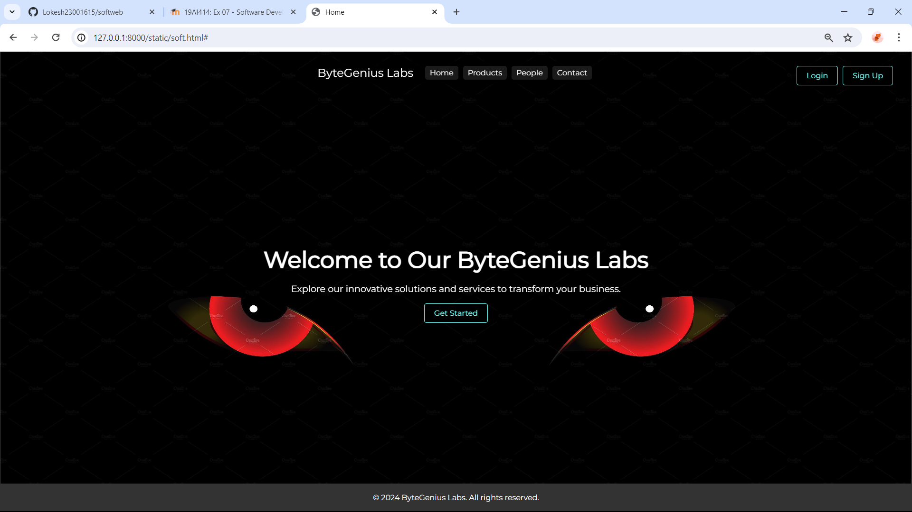
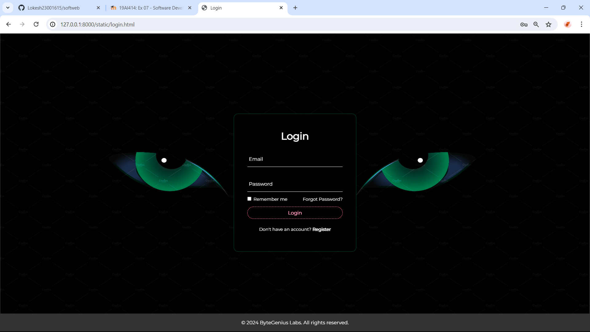
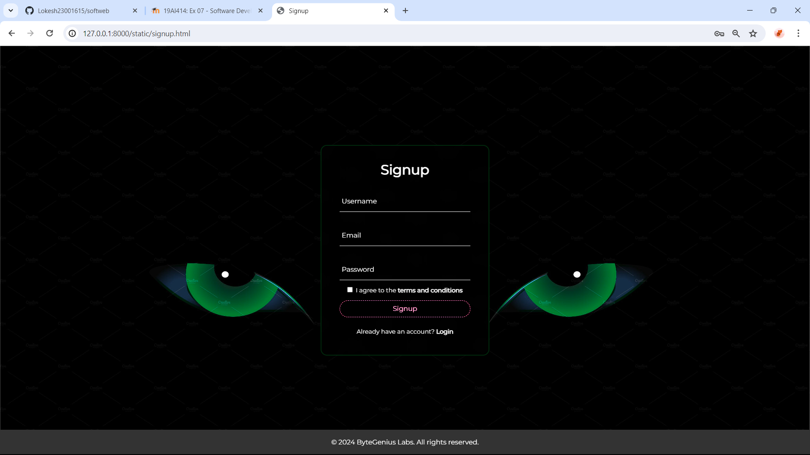
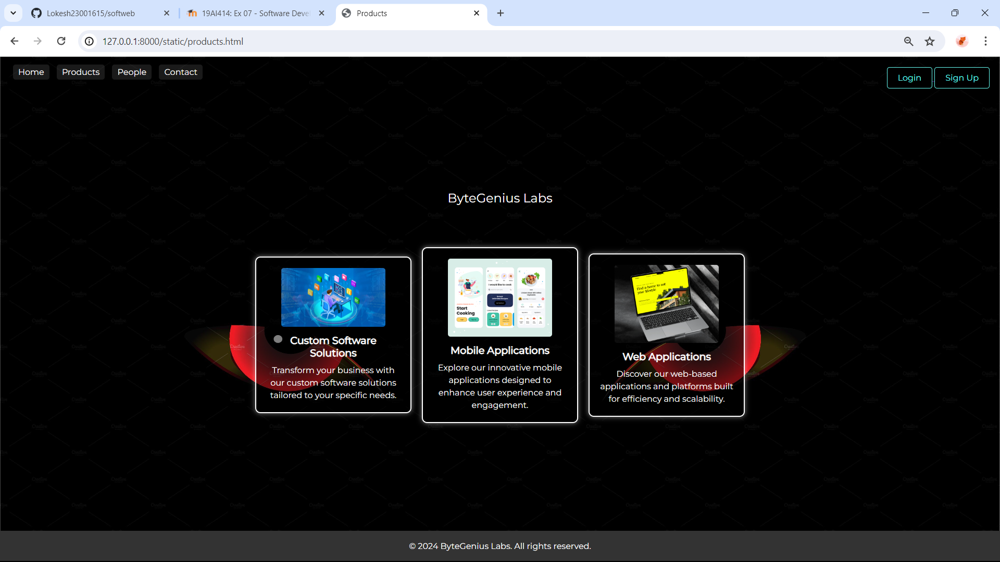

# Ex.07 Software Product Company Website
## Date:28.04.2024

## AIM:
To develop a static company website to display the softwares and services provided by the company.

## DESIGN STEPS:

### Step 1:
Requirement collection.

### Step 2:
Creating the layout using HTML and CSS.

### Step 3:
Updating the sample content.

### Step 4:
Choose the appropriate style and color scheme.

### Step 5:
Validate the layout in various browsers.

### Step 6:
Validate the HTML code.

### Step 7:
Publish the website in the given URL.

## PROGRAM:
## soft.html
```
<!DOCTYPE html>
<html lang="en">
<head>
    <meta charset="UTF-8">
    <meta name="viewport" content="width=device-width, initial-scale=1.0">
    <title>Home</title>
    <style>
        @import url('https://fonts.googleapis.com/css2?family=Montserrat&display=swap');

        * {
            margin: 0;
            padding: 0;
            box-sizing: border-box;
            font-family: 'Montserrat', sans-serif;
        }

        :root {
            --black-color: #fff;
        }

        .wrapper {
            display: flex;
            justify-content: center;
            align-items: center;
            height: 100vh;
            width: 100%;
            background: url('https://i.pinimg.com/originals/09/05/a7/0905a74092fa43fce6218aa48f6a26a4.jpg') no-repeat;
            background-size: cover;
            background-color: #66fcf1;
            animation: animateBg 4s linear infinite;
            position: relative; /* Added */
        }

        @keyframes animateBg {
            100% {
                filter: hue-rotate(360deg);
            }
        }

        .content {
            text-align: center;
            color: var(--black-color);
            padding: 20px;
        }

        h1 {
            font-size: 3em;
            margin-bottom: 20px;
        }

        p {
            font-size: 1.2em;
            margin-bottom: 30px;
        }

        .btn {
            padding: 10px 20px;
            font-size: 1em;
            background-color: #000;
            color: #66fcf1;
            border: 1px solid #66fcf1;
            border-radius: 5px;
            cursor: pointer;
            transition: all 0.3s ease;
            text-decoration: none;
        }

        .btn:hover {
            background-color: #66fcf1;
            color: #000;
        }

        .navigation, .login-signup {
            display: none;
            position: absolute;
            top: 20px;
            z-index: 999;
            background-color: rgba(0, 0, 0, 0.7);
            padding: 10px;
            border-radius: 5px;
        }

        .navigation a {
            color: #fff;
            text-decoration: none;
            padding: 5px 10px;
            margin: 0 5px;
            border-radius: 5px;
            transition: all 0.3s ease;
            background-color: rgba(255, 255, 255, 0.1);
        }

        .navigation a:hover {
            background-color: rgba(255, 255, 255, 0.3);
        }

        .logo {
            color: #fff;
            font-size: 1.5em;
            margin-right: 20px;
        }

        .login-signup {
            position: absolute;
            top: 20px;
            right: 20px;
        }

        .login-signup button {
            margin-right: 10px; /* Added */
        }

        /* Checkbox Hack */
        #toggleNav {
            display: none;
        }

        #toggleNav:checked + .wrapper .navigation,
        #toggleNav:checked + .wrapper .login-signup {
            display: flex;
        }

        @media (max-width: 768px) {
            h1 {
                font-size: 2.5em;
            }

            p {
                font-size: 1em;
            }
        }

      
        footer {
            position: fixed;
            bottom: 0;
            width: 100%;
            background-color: #333;
            color: #fff;
            text-align: center;
            padding: 20px 0;
        }

    </style>
</head>
<body>
<input type="checkbox" id="toggleNav">
<div class="wrapper">
    <div class="content">
        <h1>Welcome to Our ByteGenius Labs</h1>
        <p>Explore our innovative solutions and services to transform your business.</p>
        <label for="toggleNav" class="btn">Get Started</label>
    </div>
    <div class="navigation">
        <div class="logo">ByteGenius Labs</div>
        <a href="#">Home</a>
        <a href="products.html">Products</a>
        <a href="people.html">People</a>
        <a href="contact.html">Contact</a>
    </div>
    <div class="login-signup">
        <a href="login.html">
            <button class="btn">Login</button>
        </a>
        <a href="signup.html">
            <button class="btn">Sign Up</button>
        </a>
    </div>
</div>
<footer>
    &copy; 2024 ByteGenius Labs. All rights reserved.
</footer>
</body>
</html>

```
## login.html
```
<!DOCTYPE html>
<html lang="en">
<head>
    <meta charset="UTF-8">
    <meta name="viewport" content="width=device-width, initial-scale=1.0">
    <title>Login</title>

    <style>
        @import url('https://fonts.googleapis.com/css2?family=Montserrat&display=swap');

* {
  margin:0;
  padding:0;
  box-sizing:border-box;
  font-family: 'Montserrat', sans-serif;
}
:root{
  --black-color:#fff;
}

.wrapper {
  display:flex;
  justify-content:center;
  align-items: center;
  height:100vh;
  width:100%;
  background:url('https://i.pinimg.com/originals/09/05/a7/0905a74092fa43fce6218aa48f6a26a4.jpg') no-repeat;
  background-size:cover;
  background-position:center;
  background-color: #66fcf1;
  animation:animateBg 4s linear infinite;
}
@keyframes animateBg {
  100% {
    filter:hue-rotate(360deg);
  }
}
.login-box {
  position: relative;
  width: 400px;
  height: 450px;
  background: transparent;
  border-radius: 15px;
  border: 2px solid rgba(255, 0, 0, 0.349);
  display: flex;
  justify-content: center;
  align-items: center;
  backdrop-filter: blur(15px);
}
h2 {
  font-size:2em;
  color:var(--black-color);
  text-align:center;
}
.input-box {
  position:relative;
  width:310px;
  margin:30px 0;
  border-bottom:1px solid var(--black-color);
}
.input-box label {
  position:absolute;
  top:50%;
  left:5px;
  transform:translateY(-50%);
  font-size:1em;
  color:var(--black-color);
  pointer-events:none;
  transition:.5s;
}
.input-box input:focus  ~ label,
.input-box input:valid  ~ label {
  top:-5px;
}
.input-box input {
  width:100%;
  height:50px;
  background:transparent;
  border:none;
  outline:none;
  font-size:1em;
  color:var(--black-color);
  padding:0 35px 0 5px;
}
.input-box .icon {
  position:absolute;
  right:8px;
  top:50%;
  color: var(--black-color);
  transform: translateY(-50%);
}
.remember-forgot {
  margin:-15px 0 15px;
  font-size:.9em;
  color:var(--black-color);
  display:flex;
  justify-content:space-between;
}
.remember-forgot label input {
  margin-right:3px;
}
.remember-forgot a {
  color:var(--black-color);
  text-decoration:none;
}
.remember-forgot a:hover {
  text-decoration:underline;
}
button {
  width:100%;
  height:40px;
  background-color:#000;
  border:1px dashed aqua;
  border-radius:40px;
  cursor:pointer;
  font-size:1em;
  color:#66fcf1;
  font-weight:500;
}
.register-link {
  font-size:.9em;
  color:var(--black-color);
  text-align:center;
  margin:25px 0 10px;
}
.register-link p a {
  color:var(--black-color);
  text-decoration:none;
  font-weight:600;
}
.register-link p a:hover {
  text-decoration:underline;
}
@media (max-width:500px) {
  .login-box {
    width:100%;
    height:100vh;
    border:none;
    border-radius:0;
  }
  .input-box {
    width:290px;
  }
}
footer{

           position: fixed;
            bottom: 0;
            width: 100%;
            background-color: #333;
            color: #fff;
            text-align: center;
            padding: 20px 0;
}


    </style>
</head>
<link rel="stylesheet" href="style.css">
<body>
    <div class="wrapper">

        <div class="login-box">
          <form action="">
            <h2>Login</h2>
      
            <div class="input-box">
              <span class="icon">
                <ion-icon name="mail"></ion-icon>
              </span>
              <input type="email" required>
              <label>Email</label>
            </div>
      
            <div class="input-box">
              <span class="icon">
                <ion-icon name="lock-closed"></ion-icon>
              </span>
              <input type="password" required>
              <label>Password</label>
            </div>
      
            <div class="remember-forgot">
              <label><input type="checkbox"> Remember me</label>
              <a href="#">Forgot Password?</a>
            </div>
      
            <button type="submit">Login</button>
      
            <div class="register-link">
              <p>Don't have an account? <a href="#">Register</a></p>
            </div>
          </form>
        </div>
      
      </div>
      <footer>
        &copy; 2024 ByteGenius Labs. All rights reserved.
      </footer>
</body>
</html>
```
## signup.html
```
<!D<!DOCTYPE html>
<html lang="en">
<head>
    <meta charset="UTF-8">
    <meta name="viewport" content="width=device-width, initial-scale=1.0">
    <title>Signup</title>
    <style>
        @import url('https://fonts.googleapis.com/css2?family=Montserrat&display=swap');

        * {
            margin: 0;
            padding: 0;
            box-sizing: border-box;
            font-family: 'Montserrat', sans-serif;
        }

        :root {
            --black-color: #fff;
        }

        .wrapper {
            display: flex;
            justify-content: center;
            align-items: center;
            height: 100vh;
            width: 100%;
            background: url('https://i.pinimg.com/originals/09/05/a7/0905a74092fa43fce6218aa48f6a26a4.jpg') no-repeat;
            background-size: cover;
            background-color: #66fcf1;
            animation: animateBg 4s linear infinite;
        }

        @keyframes animateBg {
            100% {
                filter: hue-rotate(360deg);
            }
        }

        .signup-box {
            position: relative;
            width: 400px;
            height: 500px;
            background: transparent;
            border-radius: 15px;
            border: 2px solid rgba(255, 0, 0, 0.349);
            display: flex;
            justify-content: center;
            align-items: center;
            backdrop-filter: blur(15px);
        }

        h2 {
            font-size: 2em;
            color: var(--black-color);
            text-align: center;
        }

        .input-box {
            position: relative;
            width: 310px;
            margin: 30px 0;
            border-bottom: 1px solid var(--black-color);
        }

        .input-box label {
            position: absolute;
            top: 50%;
            left: 5px;
            transform: translateY(-50%);
            font-size: 1em;
            color: var(--black-color);
            pointer-events: none;
            transition: .5s;
        }

        .input-box input:focus ~ label,
        .input-box input:valid ~ label {
            top: -5px;
        }

        .input-box input {
            width: 100%;
            height: 50px;
            background: transparent;
            border: none;
            outline: none;
            font-size: 1em;
            color: var(--black-color);
            padding: 0 35px 0 5px;
        }

        .input-box .icon {
            position: absolute;
            right: 8px;
            top: 50%;
            color: var(--black-color);
            transform: translateY(-50%);
        }

        .agree-terms {
            margin: -15px 0 15px;
            font-size: .9em;
            color: var(--black-color);
            display: flex;
            justify-content: center;
            align-items: center;
        }

        .agree-terms label input {
            margin-right: 3px;
        }

        .agree-terms a {
            color: var(--black-color);
            text-decoration: none;
            font-weight: 600;
        }

        .agree-terms a:hover {
            text-decoration: underline;
        }

        button {
            width: 100%;
            height: 40px;
            background-color: #000;
            border: 1px dashed aqua;
            border-radius: 40px;
            cursor: pointer;
            font-size: 1em;
            color: #66fcf1;
            font-weight: 500;
        }

        .login-link {
            font-size: .9em;
            color: var(--black-color);
            text-align: center;
            margin: 25px 0 10px;
        }

        .login-link p a {
            color: var(--black-color);
            text-decoration: none;
            font-weight: 600;
        }

        .login-link p a:hover {
            text-decoration: underline;
        }

        @media (max-width: 500px) {
            .signup-box {
                width: 100%;
                height: 100vh;
                border: none;
                border-radius: 0;
            }

            .input-box {
                width: 290px;
            }
        }
        footer{
            position: fixed;
            bottom: 0;
            width: 100%;
            background-color: #333;
            color: #fff;
            text-align: center;
            padding: 20px 0;
        }
    </style>
</head>
<body>
<div class="wrapper">
    <div class="signup-box">
        <form action="">
            <h2>Signup</h2>

            <div class="input-box">
                <span class="icon">
                  <ion-icon name="person-add"></ion-icon>
                </span>
                <input type="text" required>
                <label>Username</label>
            </div>

            <div class="input-box">
                <span class="icon">
                  <ion-icon name="mail"></ion-icon>
                </span>
                <input type="email" required>
                <label>Email</label>
            </div>

            <div class="input-box">
                <span class="icon">
                  <ion-icon name="lock-closed"></ion-icon>
                </span>
                <input type="password" required>
                <label>Password</label>
            </div>

            <div class="agree-terms">
                <label><input type="checkbox"> I agree to the <a href="#">terms and conditions</a></label>
            </div>

            <button type="submit">Signup</button>

            <div class="login-link">
                <p>Already have an account? <a href="#">Login</a></p>
            </div>
        </form>
    </div>
</div>
<footer>
    
    &copy; 2024 ByteGenius Labs. All rights reserved.
</footer>
</body>
</html>

```
## products.html
```
<!DOCTYPE html>
<html lang="en">
<head>
    <meta charset="UTF-8">
    <meta name="viewport" content="width=device-width, initial-scale=1.0">
    <title>Products</title>
    <style>
        @import url('https://fonts.googleapis.com/css2?family=Montserrat&display=swap');

        * {
            margin: 0;
            padding: 0;
            box-sizing: border-box;
            font-family: 'Montserrat', sans-serif;
        }

        .wrapper {
            display: flex;
            flex-direction: column; /* Added */
            justify-content: center;
            align-items: center;
            min-height: 100vh; /* Changed */
            width: 100%;
            background: url('https://i.pinimg.com/originals/09/05/a7/0905a74092fa43fce6218aa48f6a26a4.jpg') no-repeat;
            background-size: cover;
            background-color: #66fcf1;
            position: relative;
        }

        .navigation {
            position: absolute;
            top: 20px;
            left: 20px;
            z-index: 999;
        }

        .navigation a {
            color: #fff;
            text-decoration: none;
            padding: 5px 10px;
            margin: 0 5px;
            border-radius: 5px;
            transition: all 0.3s ease;
            background-color: rgba(255, 255, 255, 0.1);
        }

        .navigation a:hover {
            background-color: rgba(255, 255, 255, 0.3);
        }

        .company-name {
            color: #fff;
            font-size: 1.5em;
            margin-bottom: 20px;
        }

        .login-signup {
            position: absolute;
            top: 20px;
            right: 20px;
        }

        .login-signup button {
            padding: 10px 20px;
            font-size: 1em;
            background-color: #000;
            color: #66fcf1;
            border: 1px solid #66fcf1;
            border-radius: 5px;
            cursor: pointer;
            transition: all 0.3s ease;
            text-decoration: none;
        }

        .login-signup button:hover {
            background-color: #66fcf1;
            color: #000;
        }

        .products {
            display: flex;
            justify-content: center;
            align-items: center;
            flex-wrap: wrap;
            margin-top: 50px;
        }

        .product {
            margin: 10px;
            padding: 20px;
            background-color: rgba(0, 0, 0, 0.5); /* Changed */
            border: 2px solid #fff; /* Added */
            border-radius: 10px; /* Added */
            box-shadow: 0 0 10px rgba(255, 255, 255, 0.5); /* Added */
            text-align: center;
            width: 300px;
            transition: all 0.3s ease; /* Added */
        }

        .product img {
            width: 200px;
            border-radius: 5px;
            margin-bottom: 10px;
        }

        .product h3 {
            font-size: 1.2em;
            margin-bottom: 10px;
            color: #fff; /* Added */
        }

        .product p {
            font-size: 1em;
            line-height: 1.5;
            color: #fff; /* Added */
        }

        .product:hover {
            transform: translateY(-5px); /* Added */
            box-shadow: 0 5px 15px rgba(0, 0, 0, 0.3); /* Added */
        }
        footer{

            position: fixed;
            bottom: 0;
            width: 100%;
            background-color: #333;
            color: #fff;
            text-align: center;
            padding: 20px 0;
        }

    </style>
</head>
<body>
<div class="wrapper">
    <div class="navigation">
        <a href="soft.html">Home</a>
        <a href="products.html">Products</a>
        <a href="people.html">People</a>
        <a href="products.html">Contact</a>
    </div>
    <div class="company-name">ByteGenius Labs</div>
    <div class="login-signup">
        <a href="login.html">
            <button>Login</button>
        </a>
        <a href="signup.html">
            <button>Sign Up</button>
        </a>
    </div>
    <div class="products">
        <div class="product">
            
            <h3>Custom Software Solutions</h3>
            <p>Transform your business with our custom software solutions tailored to your specific needs.</p>
        </div>
        <div class="product">
            
            <h3>Mobile Applications</h3>
            <p>Explore our innovative mobile applications designed to enhance user experience and engagement.</p>
        </div>
        <div class="product">
            
            <h3>Web Applications</h3>
            <p>Discover our web-based applications and platforms built for efficiency and scalability.</p>
        </div>
    </div>

</div>
<footer>
    &copy; 2024 ByteGenius Labs. All rights reserved.
</footer>
</body>
</html>

```
## people.html
```
<!DOCTYPE html>
<html lang="en">
<head>
    <meta charset="UTF-8">
    <meta name="viewport" content="width=device-width, initial-scale=1.0">
    <title>Peoples</title>
    <style>
        @import url('https://fonts.googleapis.com/css2?family=Montserrat&display=swap');

        * {
            margin: 0;
            padding: 0;
            box-sizing: border-box;
            font-family: 'Montserrat', sans-serif;
        }

        .wrapper {
            display: flex;
            flex-direction: column;
            justify-content: center;
            align-items: center;
            min-height: 100vh;
            width: 100%;
            background: url('https://i.pinimg.com/originals/09/05/a7/0905a74092fa43fce6218aa48f6a26a4.jpg') no-repeat;
            background-size: cover;
            background-color: #66fcf1;
            position: relative;
            padding: 20px; /* Added */
        }

        .navigation {
            position: absolute;
            top: 20px;
            left: 20px;
            z-index: 999;
        }

        .navigation a {
            color: #fff;
            text-decoration: none;
            padding: 5px 10px;
            margin: 0 5px;
            border-radius: 5px;
            transition: all 0.3s ease;
            background-color: rgba(255, 255, 255, 0.1);
        }

        .navigation a:hover {
            background-color: rgba(255, 255, 255, 0.3);
        }

        .company-name {
            color: #fff;
            font-size: 1.5em;
            margin-bottom: 20px;
        }

        .login-signup {
            position: absolute;
            top: 20px;
            right: 20px;
        }

        .login-signup button {
            padding: 10px 20px;
            font-size: 1em;
            background-color: #000;
            color: #66fcf1;
            border: 1px solid #66fcf1;
            border-radius: 5px;
            cursor: pointer;
            transition: all 0.3s ease;
            text-decoration: none;
        }

        .login-signup button:hover {
            background-color: #66fcf1;
            color: #000;
        }

        .people {
            display: flex;
            justify-content: center;
            align-items: center;
            flex-wrap: wrap;
            margin-top: 50px;
        }

        .person {
            margin: 10px;
            padding: 20px;
            background-color: rgba(0, 0, 0, 0.5);
            border: 2px solid #fff;
            border-radius: 10px;
            box-shadow: 0 0 10px rgba(255, 255, 255, 0.5);
            text-align: center;
            width: 300px;
            transition: all 0.3s ease;
        }

        .person img {
            width: 200px;
            height: 200px; /* Added */
            border-radius: 50%; /* Added */
            margin-bottom: 10px;
        }

        .person h3 {
            font-size: 1.5em; /* Increased */
            margin-bottom: 10px;
            color: #fff;
        }

        .person p {
            font-size: 1em;
            line-height: 1.5;
            color: #fff;
        }

        .person:hover {
            transform: translateY(-5px);
            box-shadow: 0 5px 15px rgba(0, 0, 0, 0.3);
        }
        footer{

            position: fixed;
            bottom: 0;
            width: 100%;
            background-color: #333;
            color: #fff;
            text-align: center;
            padding: 20px 0;
        }
    </style>
</head>
<body>
<div class="wrapper">
    <div class="navigation">
        <a href="soft.html">Home</a>
        <a href="products.html">Products</a>
        <a href="people.html">People</a>
        <a href="contact.html">Contact</a>
    </div>
    <div class="company-name">ByteGenius Labs</div>
    <div class="login-signup">
        <a href="login.html">
            <button>Login</button>
        </a>
        <a href="signup.html">
            <button>Sign Up</button>
        </a>
    </div>
    <div class="people">
        <div class="person">
            
            <h3>Lokesh</h3>
            <p>CEO</p>
        </div>
        <div class="person">
            
            <h3>Jane Smith</h3>
            <p>Co-founder</p>
        </div>
        <div class="person">
            
            <h3>Michael Johnson</h3>
            <p>Director</p>
        </div>
        <div class="person">
            
            <h3>Emily Brown</h3>
            <p>Assistant Director</p>
        </div>
    </div>
</div>
<footer>
    &copy; 2024 ByteGenius Labs. All rights reserved.
</footer>
</body>
</html>


```
## contact.html
```
<!DOCTYPE html>
<html lang="en">
<head>
    <meta charset="UTF-8">
    <meta name="viewport" content="width=device-width, initial-scale=1.0">
    <title>Contact</title>
    <style>
        @import url('https://fonts.googleapis.com/css2?family=Montserrat&display=swap');

        * {
            margin: 0;
            padding: 0;
            box-sizing: border-box;
            font-family: 'Montserrat', sans-serif;
        }

        .wrapper {
            display: flex;
            flex-direction: column;
            justify-content: center;
            align-items: center;
            min-height: 100vh;
            width: 100%;
            background: url('https://i.pinimg.com/originals/09/05/a7/0905a74092fa43fce6218aa48f6a26a4.jpg') no-repeat;
            background-size: cover;
            background-color: #66fcf1;
            position: relative;
        }

        .navigation, .login-signup {
            display: none;
            position: absolute;
            top: 20px;
            z-index: 999;
            background-color: rgba(0, 0, 0, 0.7);
            padding: 10px;
            border-radius: 5px;
        }

        .navigation a {
            color: #fff;
            text-decoration: none;
            padding: 5px 10px;
            margin: 0 5px;
            border-radius: 5px;
            transition: all 0.3s ease;
            background-color: rgba(255, 255, 255, 0.1);
        }

        .navigation a:hover {
            background-color: rgba(255, 255, 255, 0.3);
        }


        .company-name {
            color: #fff;
            font-size: 1.5em;
            margin-bottom: 20px;
        }

        .contact-info {
            color: #fff;
            font-size: 1em;
            margin-bottom: 20px;
            text-align: center;
        }

        .contact-info p {
            margin-bottom: 5px;
        }

        .contact-info .icon {
            margin-right: 10px;
            color: #66fcf1;
        }

        .contact-form {
            background-color: rgba(0, 0, 0, 0.5);
            padding: 20px;
            border-radius: 10px;
            box-shadow: 0 0 10px rgba(255, 255, 255, 0.5);
            text-align: center;
            width: 300px;
            transition: all 0.3s ease;
            animation: fadeInUp 1s forwards;
        }

        @keyframes fadeInUp {
            from {
                opacity: 0;
                transform: translateY(20px);
            }
            to {
                opacity: 1;
                transform: translateY(0);
            }
        }

        .contact-form input,
        .contact-form textarea {
            width: calc(100% - 22px);
            padding: 10px;
            margin-bottom: 10px;
            border-radius: 5px;
            border: none;
            background-color: rgba(255, 255, 255, 0.1);
            color: #fff;
            font-size: 1em;
        }

        .contact-form input:focus,
        .contact-form textarea:focus {
            outline: none;
            background-color: rgba(255, 255, 255, 0.3);
        }

        .contact-form textarea {
            resize: vertical;
        }

        .contact-form button {
            width: 100%;
            padding: 10px 20px;
            font-size: 1em;
            background-color: #000;
            color: #66fcf1;
            border: 1px solid #66fcf1;
            border-radius: 5px;
            cursor: pointer;
            transition: all 0.3s ease;
            text-decoration: none;
        }

        .contact-form button:hover {
            background-color: #66fcf1;
            color: #000;
        }

        .login-signup {
            position: absolute;
            top: 20px;
            right: 20px;
            z-index: 999;
        }

        .login-signup button {
            padding: 10px 20px;
            font-size: 1em;
            background-color: #000;
            color: #66fcf1;
            border: 1px solid #66fcf1;
            border-radius: 5px;
            cursor: pointer;
            transition: all 0.3s ease;
            text-decoration: none;
            margin-left: 10px;
        }

        .login-signup button:hover {
            background-color: #66fcf1;
            color: #000;
        }

        footer {
            position: fixed;
            bottom: 0;
            width: 100%;
            background-color: #333;
            color: #fff;
            text-align: center;
            padding: 20px 0;
        }

    </style>
</head>
<body>
<div class="wrapper">
    <div class="navigation">
        <a href="soft.html">Home</a>
        <a href="products.html">Products</a>
        <a href="people.html">People</a>
        <a href="contact.html">Contact</a>
    </div>
    <div class="company-name">ByteGenius Labs</div>
    <div class="contact-info">
        <p><span class="icon">📧</span>Email: info@bytegeniuslabs.com</p>
        <p><span class="icon">☎️</span>Phone: +1 (123) 456-7890</p>
        <h1>Contact us</h1>
    </div>
    <div class="login-signup">
        <a href="login.html">
            <button>Login</button>
        </a>
        <a href="signup.html">
            <button>Sign Up</button>
        </a>
    </div>
    <div class="contact-form">
        <h2>Contact Us</h2>
        <form action="#">
            <input type="text" name="name" placeholder="Your Name">
            <input type="email" name="email" placeholder="Your Email">
            <textarea name="message" rows="5" placeholder="Your Message"></textarea>
            <button type="submit">Submit</button>
        </form>
    </div>
</div>
<footer>
    &copy; 2024 ByteGenius Labs. All rights reserved.
</footer>
</body>
</html>


```
## OUTPUT:









## RESULT:
The program for designing software company website using HTML and CSS is completed successfully.
